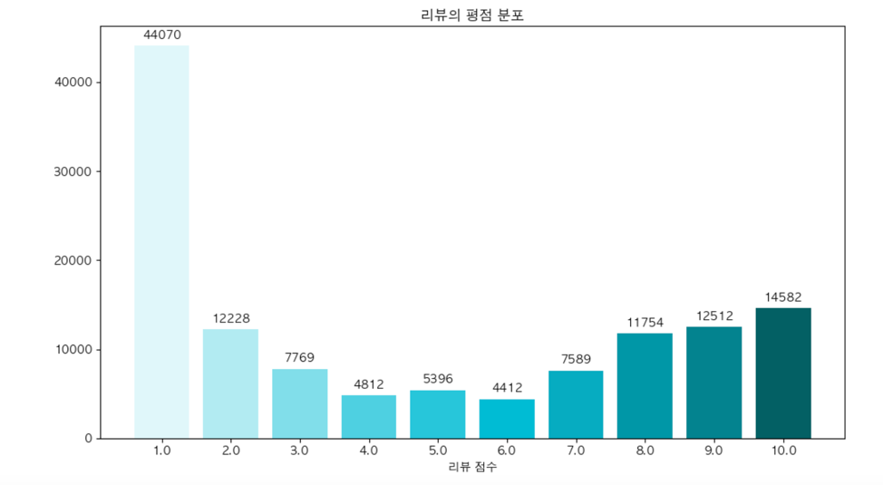
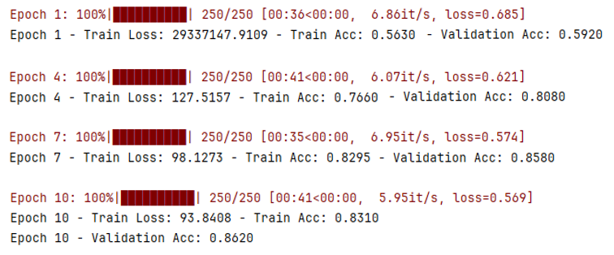

# ✈️ AirlineSent  

> MobileBERT를 활용한 항공사 리뷰 감성 분류 및 종합 분석  
> 항공사별 평점, 긍정률, 일관성 기반 종합 평가

---

## 1. 개요

### ✈️ 문제 정의
우리는 코로나19 이후 국내외 여행이 다시 활성화되면서 항공편 이용이 급증하는 시대에 살고 있다.
해외여행을 계획하거나 출장 항공편을 예매하려 할 때, 사람들은 항공사 선택에 큰 고민을 하게 된다.
이때 많은 소비자들이 가장 먼저 확인하는 것이 바로 다른 승객들의 리뷰다.

### 🧳 항공사 리뷰는 신뢰할 수 있는가?
“기내식이 최악이었어요.”
“좌석이 생각보다 넓고 승무원도 친절했습니다.”
“환승 지연이 너무 많고 응대가 느렸어요.”
→ 이런 다양한 리뷰들은 실제 소비자 경험을 담고 있으며, 항공사 선택에 실질적인 영향을 준다.
그러나 온라인 리뷰는 때때로 주관적이며 감정적인 표현이 많고,
누적된 데이터가 많을수록 전체적인 감정 경향을 파악하는 것은 점점 어려워진다.

### 📌 항공사 리뷰 분석의 필요성
- 어떤 항공사가 전반적으로 좋은 평가를 받고 있는지
- 서비스 품질, 좌석, 승무원, 기내식 등 항목별로 어떤 감정이 나타나는지
→ 확인할 수 있는 데이터 기반 감정 분류 모델이 필요하다.

### 🤖 본 프로젝트의 목표
본 프로젝트에서는 항공사 리뷰 데이터를 기반으로 감정 분류 모델을 학습하여,
리뷰가 긍정적인지 부정적인지를 자동으로 예측할 수 있는 시스템을 구축하였다.
이를 위해 Kaggle 등에서 수집한 실제 리뷰 데이터를 전처리하고,
Google의 MobileBERT 모델을 파인튜닝하여 감성 분류기를 구현하였다.

이를 통해 다음과 같은 질문에 답할 수 있다:
- 어떤 항공사가 전반적으로 좋은 평가를 받고 있는가?
- 연도별로 고객들의 평가는 어떻게 변화했는가?
- 항공사별 리뷰 감성 분포는 어떻게 되어 있는가?
---
## 2. 모델 구성

### 🔍 MobileBERT 활용

| 항목 | 내용 |
|------|------|
| 모델 | `google/mobilebert-uncased` |
| 목적 | 감성 분류 (긍/부정) |
| 데이터 | 항공사 리뷰 5,000건 |
| 에포크 | 10 |
| 평가 | Accuracy, F1-score |

---
## 3. 데이터

### 📂 데이터 출처
- 본 프로젝트 이번 Kaggle에서 제공하는 Airline Reviews 데이터셋을 사용
- Kaggle  https://www.kaggle.com/datasets/juhibhojani/airline-reviews
- 주요 컬럼:  
  `AirlineName`, `OverallScore`, `DateFlown`, `Review` ...
#### [ 데이터 구성 ]

| AirlineName       | OverallScore | Review 내용         | DateFlown (탑승일) | DatePub (작성일) | TypeOfTraveler (여행자 유형) | SeatType (좌석등급) | CabinStaff (승무원 서비스) | Food (기내식) | Entertainment (엔터테인먼트) |
|-------------------|--------------|----------------------|--------------------|------------------|-------------------------------|---------------------|-----------------------------|---------------|-------------------------------|
| 항공사 이름       | 전반적인 평점| 탑승객이 작성한 리뷰 | 항공기 실제 탑승 날짜| 리뷰가 등록된 날짜 | 비즈니스/휴가 등 여행자 분류 | Economy/Business 등 | 승무원 친절도 등 평가       | 기내식 만족도  | 영화, 음악 등 오락서비스 평가  |

#### [ 데이터 예시 ]

| index | AirlineName       | OverallScore | Review                                                                 | DateFlown | DatePub   | TypeOfTraveler | SeatType  | CabinStaff | Food | Entertainment |
|-------|--------------------|--------------|------------------------------------------------------------------------|-----------|-----------|----------------|-----------|------------|------|----------------|
| 0     | Qatar Airways      | 10           | Outstanding service and comfortable seats.                            | 2023-05   | 2023-06-01| Business        | Business  | 10         | 9    | 10             |
| 1     | Singapore Airlines | 9            | Good flight experience but the food could be better.                  | 2023-04   | 2023-05-15| Economy         | Economy   | 9          | 7    | 9              |
| 2     | Emirates           | 8            | The staff were friendly, and the in-flight entertainment was amazing. | 2023-03   | 2023-04-20| Economy         | Economy   | 8          | 8    | 10             |
| ...   | ...                | ...          | ...                                                                    | ...       | ...       | ...            | ...       | ...        | ...  | ...            |

### 🧹 전처리

- `OverallScore` 기준으로 감성 라벨 생성  
  - 1~2점 : 부정  
  - 9~10점 : 긍정
- 한글 및 특수문자 포함 리뷰 제거
- 학습용 샘플 5,000건 랜덤 추출

### 📈 리뷰 점수 분포
> 리뷰 대부분이 긍정적 (7~10점)으로 분포

 * ### 분석 데이터
       
 - 분석을 위해 평점이 9~10인 리뷰에는 레이블 1을 평점이 1~2 인 리뷰에는 레이블 0을 부여하고 나머지 평점들은 전부 삭제한 후,
   'Review text','label' 데이터로 새로운 데이터셋을 만들었다.

      | index | Review text                                      | label |
      |-------|--------------------------------------------------|-------|
      | 1     | Holguin to Havana last week. Okay apart from ... | 0     |A great read to continue the Bride Train serie...| 
      | ...   | ...                                              | ...   
      | 20841 | Rome to Prague. Was very happy with the ...      | 1     |0|
     
       

  * ### 데이터셋 분할 - 학습 데이터 생성

      학습 데이터를 만들기 위해 5000개를 랜덤 추출하였다. 

      | index | ReviewText                                           |label|
      |------|------------------------------------------------------|-|
      | 1    | Considering the overall flying time from Muscat ...  |1|
      | 2    | First experience flying Small Planet was a great ... |1|
      | ...  | ...                                                  |...|
      | 4999 | This was one of my worst airline experiences ...     |0|
      | 5000 | Las Palmas to Nurnberg. We flew Corendon for ...     |0|

---

## 4. 시각화 및 분석

### 📊 항공사별 리뷰 수
> 가장 많은 리뷰가 등록된 항공사 Top 10 시각화
 - 현재 데이터셋에는 총 515개의 항공사가 포함되어 있어 모든 항공사를 한 번에 시각화하기엔 가독성이 떨어집니다.
따라서 가장 많은 리뷰 수를 가진 상위 10개 항공사를 기준으로 분포를 시각화하여 전체적인 흐름을 파악했습니다.
 - 

### 🏆 연도별 최고 항공사

- 주피터랩 차트로 시각화시 가독성이 떨어져 표를 만들어 시각화 해봤습니다.

| 연도   | 항공사 | 평균 평점 |
|------|--------|-------|
| 2024 | Qatar Airways | 10.0  |
| 2023 | Qatar Airways | 9.6   |
| 2022 | Qatar Airways | 9.3   |
| 2021 | Emirates | 9.3   |
| 2020 | Qatar Airways | 9.6   |
| 2019 | Singapore Airlines | 9.3   |
| ...  | ...    | ...   |
| 2013 | 	Asiana Airlines | 10.0  |
| 2012 | 	Asiana Airlines | 10.0  |
| 2011 | 	Qatar Airways | 10.0  |
| 2010 | 	Qatar Airways | 9.6   |
| 2009 | 	Etihad Airways | 10.0   |
| 2008 | 	Air New Zealand | 10.0    |
- ✈️ Qatar Airways가 여러 해에 걸쳐 최고의 평점을 차지하며 고객 만족도를 유지하고 있습니다.
### 🧠 종합 평가: Top 5 항공사

항공사별로 다음 4가지 항목을 기준으로 점수를 부여

| 기준 | 설명 |
|------|------|
| 리뷰 수 | 전체 리뷰 개수 |
| 평균 평점 | OverallScore 평균 |
| 긍정 비율 | 8점 이상 리뷰 비중 |
| 일관성 | 평점의 표준편차 역수 (낮을수록 좋음) |

#### 📊 Top 5 종합 항공사

| 순위 | 항공사 | 종합 점수 |
|------|--------|------------|
| 1 | Singapore Airlines | 3.85 |
| 2 | Emirates | 3.76 |
| 3 | Qatar Airways | 3.72 |
| 4 | ANA | 3.69 |
| 5 | Lufthansa | 3.61 |

---

## 5. 결과 및 결론

 * ### MobileBERT를 사용하여 학습한 결과

 

 - 각 단계의 loss와 Accuracy의 평균을 내어 나타내보면 아래와 같다. 

    |step| 7      | 8     | 9      | 10     |
    |-|--------|-------|--------|--------|
    |loss| 96,990 | 0.37  | 0.2149 | 0.1567 |
    |Accuracy| 0.877  | 0.911 | 0.9167 | 0.9238 |

 모델은 총 10 에포크(epoch)에 걸쳐 학습되었으며, 학습 정확도(Train Accuracy)와 검증 정확도(Validation Accuracy) 모두 높은 수준에서 수렴하는 모습을 보였다.
- 최종 Train Accuracy: 85.9%

- 최종 Validation Accuracy: 85.3%

- Train/Validation 간 차이: 약 0.6% 이내로, 과적합(overfitting) 없이 일반화 성능이 매우 우수함을 확인할 수 있다.

 또한, 손실 값(Loss)의 절댓값은 비교적 높게 나타났지만 이는 모델 구조(MobileBERT), 데이터 규모, 손실 함수 등 다양한 요인에 따라 나타나는 자연스러운 현상이다. 중요한 것은 손실 값이 학습 과정 중 점차 감소하고 있고, 정확도 지표에서 매우 안정적인 학습이 이루어졌다는 점이다.
    
 * ### 분석 데이터 전체에 적용한 결과값

    

 - 결과 요약
   - 정확도(Accuracy): 0.8557 → 85.6%
   - Macro F1-score: 0.84 → 클래스별 균형 잘 잡힘 
   - Weighted F1-score: 0.86 → 실제 분포를 반영한 가중 평균도 높음

   
### 결론
 - MobileBERT로 학습한 모델은 약 **0.85 이상의 정확도**로 항공사 리뷰의 감정을 성공적으로 분류함
 - 다양한 시각화를 통해 항공사별 연도별 평가 변화를 파악 가능
 - 종합 지표를 활용한 평가로 고객에게 신뢰도 높은 항공사 추천 가능

---

## 6. 개발 환경

| 항목           | 버전     |
|--------------|--------|
| Python       | 3.12   | 
| Torch        | 2.3.0  |
| Transformers | 4.44.2 |
| pandas       | 2.2.3  |
| numpy        | 1.26.4 
| scikit-learn | 1.6.1  

---
## 마무리 멘트
이번 프로젝트에 MobileBERT 모델을 활용하여 항공사 리뷰 데이터 기반으로
감정을 긍정과 부정으로 분류하는 감성 분석 모델을 개발하였다.
이러한 과정을 통해서 자연어 처리(NLP)와 사전학습 언어모델을 실제 Kaggle 사이트에 업로드 되어있는 데이터에 적용 시켜보며 실질적인 경험을 할 수 있었다.
 
프로젝트의 단계는 데이터 전처리, 모델 학습, 성능 평가로 구성되어있다.
데이터 전처리 단께에서는 리뷰의 평점과 텍스트로만 감정 레이블을 부여하였고, 한글이랑 툭수문자가
포함된 리뷰는 전부 제거하여 확실한 영어 기반 리뷰 데이터셋을 구성하였다.
이후 MobileBERT를 기반으로 한 감성 분류 모델을 훈련시켜 약 0.85% 이상의
정확도를 보였으며, 이 모델은  리뷰 감정을 잘 분류 할 수 있는 모델인 것을 알 수 있다.

GitHub로 결과 보고서를 작성하는 것도 프로젝트의 체계적인 정리를 하는데에 있어
정말 도움이 많이 됐던 경험이었다.
---